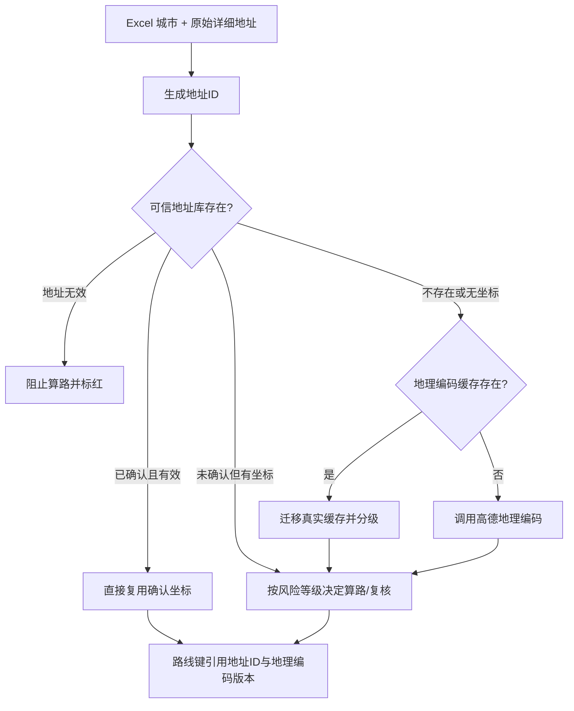

# TASK-005A 可信地址库设计

设计版本：`confirmed-address-v1`  
清洗算法：`address-cleaner-v1`  
地理编码合同：`amap-geocode-v3-contract-2026-02-02`

## 设计目标

系统把“订单行”与“地址事实”分离。每个唯一地址只解析、确认和纠正一次；订单行只引用地址ID和当前地理编码版本。原 Excel 的城市与详细地址永远只读，用户修正仅保存在本地可信地址库的 `query_address`。

## 地址身份

`address_id = SHA-256("confirmed-address-v1", 规范城市, 清洗详细地址)`。

- 发货/目的角色、工作簿路径和 Excel 行号不参与地址ID，因此同地址可跨角色、跨行、跨工作簿复用。
- 城市参与地址ID，避免错误的 Excel 城市在人工确认前借用另一城市身份的结论。样表因此有 30 个详细地址文本、31 个地址身份。
- 地址哈希与地址ID只作为稳定匹配键；界面和导入导出不依赖 Excel 行号。

## SQLite 表

正式库仍为 `cache/driving_real.sqlite`，新增独立表 `confirmed_addresses`：

| 字段组 | 字段 |
| --- | --- |
| 身份与原始值 | `address_id`、`original_city`、`original_address`、`address_hash` |
| 清洗与查询 | `cleaned_address`、`query_address`、`cleaner_version` |
| 高德标准结果 | `formatted_address`、`province`、`city`、`district`、`street`、`number`、`level`、`longitude`、`latitude` |
| 确认 | `confirmation_status`、`confirmed_by`、`confirmed_at`、`confirmation_note` |
| 版本与来源 | `data_source`、`geocode_contract_version`、`geocode_version`、`created_at`、`updated_at` |
| 风险证据 | `city_conflict`、`risk_level`、`risk_reason` |

数据库启用 WAL、外键和 `synchronous=FULL`。旧库打开时自动以幂等方式建表并给 `route_cache` 增加版本引用列，不删除 TASK-004R 缓存或历史任务。

## 确认状态

| 状态 | 含义 | 可否自动算路 |
| --- | --- | --- |
| 未确认 | 已有结果但需要人看一次，或修正地址尚待解析 | 取决于风险等级 |
| 系统高可信 | 满足高可信规则且无城市/行政冲突 | 是 |
| 人工确认 | 用户确认原查询结果正确 | 是 |
| 人工修正后确认 | 用户修改查询地址或坐标后确认 | 是 |
| 地址无效 | 用户明确判定不能用于算路 | 否 |
| 待进一步核实 | 证据不足、错行政区或多目的地 | 否 |

人工确认状态覆盖自动风险提示，但不会修改原 Excel。地址无效始终阻止算路。

## 地理编码版本与路线缓存

`geocode_version` 由查询地址、地理编码合同、标准地址各结构字段、level 和六位小数坐标共同计算。`route_cache` 新增：

- `origin_address_id`
- `destination_address_id`
- `origin_geocode_version`
- `destination_geocode_version`

新版路线键也包含两端 `geocode_version`。因此：

1. 修改 `query_address` 会立即清空旧地理编码版本，并删除引用该地址ID的路线缓存；
2. 重新解析或人工改坐标会生成新版本，再次删除旧版本相关路线；
3. 行级输入摘要包含地址版本、确认状态和查询地址，历史 `row_results` 不会掩盖地址变更；
4. TASK-004R 旧路线首次命中时可一次性迁移为带版本引用的新缓存，不发起额外 HTTP；
5. 本次样表形成 24 个带两端地址ID和版本的有效唯一路线缓存。

## 地址解析与复用流程

可信地址库复用会写入审计字段 `origin_address_source` / `destination_address_source`，值为“可信地址库复用”；不会重复调用地理编码。

## 精度分级

### 系统高可信

- 门牌号或高德实际别名“门址”，且道路、门牌或核心名称匹配；
- 兴趣点/企业级且核心名称匹配；
- 道路级且道路或核心名称匹配；
- 住宅区级但明确企业、园区或仓库名称匹配；
- 已有人工确认记录；
- 以上自动规则均要求无城市冲突、无行政区/街道冲突、坐标在中国合理范围。

### 建议人工复核

- 乡镇、村庄、街道；
- 住宅区名称不足；
- 道路级但缺少原企业/园区名称；
- 兴趣点名称不足；
- level 未知但仍有道路/核心名称证据；
- 城市冲突；
- 高级别结果存在区县差异但 POI 核心名称仍匹配。

这些地址允许保留参考距离，状态“查询成功—定位待复核”或“查询成功—地址冲突待确认”。

### 不允许自动算路

- 国家、省、市级；
- 区县级且未匹配道路、园区、企业或 POI；
- 坐标缺失、越界或明显不在中国；
- 低层级结果出现行政区、街道或乡镇冲突；
- 无法解析；
- 多目的地组合；
- 地址被标记无效。

没有把全部 level 统一放宽。

## 地址确认界面

主窗口新增“地址确认（唯一地址一次确认）”区域，显示：地址用途、Excel 城市、Excel 原始详细地址、高德标准地址、level、经纬度、城市冲突、确认状态、修正查询地址、关联订单行数和关联路线数。内部地址ID列隐藏但用于稳定选择。

已实现操作：

- 刷新唯一地址清单；
- 重新解析当前地址；
- 使用原始地址；
- 使用高德标准地址；
- 保存修正地址；
- 确认定位正确；
- 标记地址无效；
- 批量确认高可信地址；
- 仅查看未确认；
- 导出待确认清单；
- 导入确认结果。

只有“用于查询的修正地址”可编辑。保存后界面明确提示原 Excel 地址没有修改。

## Excel 待确认清单合同

固定列为：地址ID、原始城市、原始详细地址、高德标准地址、定位层级、修正查询地址、是否确认、确认备注。

导入规则：

- 按地址ID匹配，不读 Excel 行号；
- 重复地址ID且内容相同则跳过；内容冲突则失败；
- “是否确认”支持“是/否/地址无效/待进一步核实”；
- 修正查询地址后必须重新地理编码，不能拿旧坐标直接确认；
- 返回成功、跳过、失败数量及前若干错误原因。

## 工作簿保护边界

可信地址库是独立 SQLite 数据，不回写原城市或原详细地址。输出工作簿仍只追加/复用三个普通驾车结果列。A:P 原值和公式、图片、筛选、隐藏行、原条件格式和非目标行全部沿用 TASK-004R 的保存保护。

